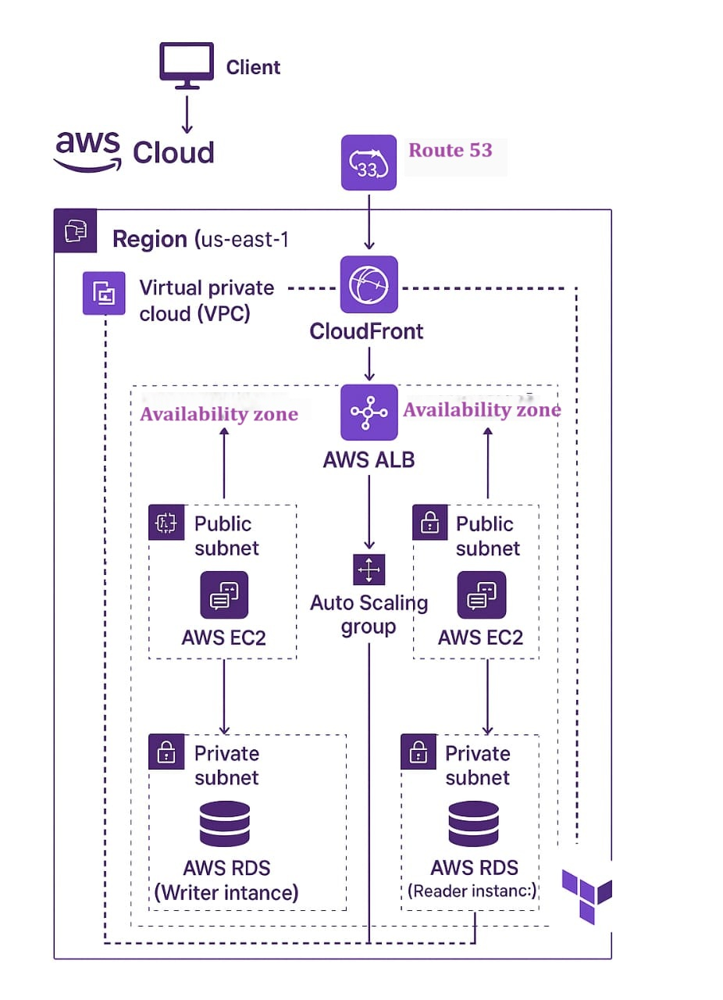

# AWS Two-Tier Architecture with Terraform (Modularized)
This project demonstrates a Two-Tier architecture on AWS using Terraform for Infrastructure as Code (IaC). It follows a modular and security-enhanced approach to create a scalable, secure, and maintainable infrastructure.

## 🚀 Architecture Overview
The architecture includes:
VPC with public and private subnets across two Availability Zones
EC2 instance in the public subnet (web tier)
RDS (MySQL) instance in private subnets (database tier)
Application Load Balancer (ALB) for EC2
CloudFront in front of ALB
WAF attached to CloudFront
Route53 for domain routing (optional)

---
✅ Key Features
* Modular Architecture – Reusable Terraform modules for better management
* Infrastructure as Code (IaC) – Automate AWS resource provisioning
* Security Best Practices – IAM roles, policies, and WAF integration
* Scalability & High Availability – Auto Scaling, Load Balancing, and Route 53
* Database Integration – Managed Amazon RDS deployment
---
## 📁 Project Structure

 
 
---
## ⚙️ How to Use
1. Clone the Repository
git clone https://github.com/SAYAND-VENGILATT/terraform-aws-two-tier-architecture.git

cd aws-two-tier-terraform

2. Set Your Variables
Edit the terraform.tfvars file with your AWS details and configuration values.

3. Initialize Terraform
terraform init

4. Terraform Plan
terraform plan

5. Terraform Apply 
terraform apply

To destroy:
terraform destroy

---
## 🧠 Learning Objectives
Learn Infrastructure as Code (IaC) using Terraform
Understand AWS networking and security
Practice modular Terraform design
Safely simulate real-world cloud architecture

---
## 📌 Notes
You can use mock values or fake domains in terraform.tfvars for simulation.
Add a billing alarm in AWS to monitor usage.

---
## 📄 License
MIT

---
## ✍️ Author
SAYAND VENGILATT

LinkedIn-  www.linkedin.com/in/sayand-vengilatt-7a4b5a30a 

